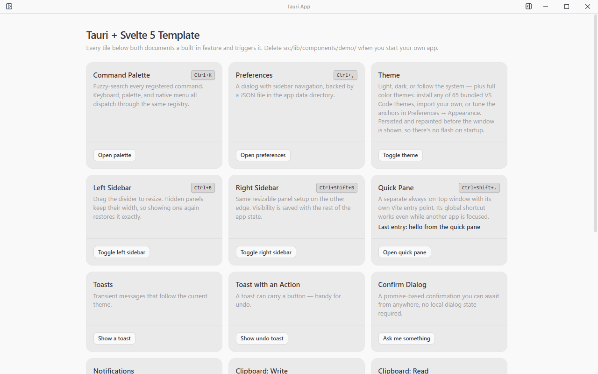

<h1 align="center">Tauri Svelte Template</h1>

<p align="center">
  <a href="https://github.com/frostybee/tauri-svelte-template/actions/workflows/ci.yml"></a>
  <a href="LICENSE"></a>
  
  
  
</p>

<p align="center">
  <a href="USING_THIS_TEMPLATE.md"><strong>Using this template</strong></a> ·
  <a href="docs/developer/README.md">Developer docs</a> ·
  <a href="#quick-start">Quick start</a> ·
  <a href="#whats-already-built">Features</a> ·
  <a href="https://github.com/frostybee/tauri-svelte-template/releases">Releases</a>
</p>

A "batteries-included" template for building production-ready desktop applications with **Tauri v2**, **Svelte 5**, and **TypeScript**. Clone it, rename a few strings, and start building on a foundation that already handles the parts every desktop app needs.

<p align="center">
  
</p>

## Why This Template?

Most Tauri starters give you a blank canvas. This template gives you a **working application** with patterns already established:

- **Type-safe Rust-TypeScript bridge** via tauri-specta with generated bindings
- **Performance patterns enforced by tooling** including ast-grep rules for Svelte 5 IPC footguns
- **Multi-window architecture** already working (Quick Pane with global shortcut as a demo)
- **Cross-platform ready** with platform-specific titlebars, window controls, and native menu integration
- **i18n built-in** with RTL support, reactive translations, and menus that rebuild on language change
- **VS Code theme support** with an OKLCH derivation engine that turns any VS Code theme JSON into a full app theme

## Stack

| Layer | Technologies |
| --- | --- |
| Frontend | Svelte 5, TypeScript, Vite |
| UI | shadcn-svelte, Tailwind CSS v4, Lucide Svelte |
| State | Svelte 5 runes, JSON store persistence, paneforge |
| Backend | Tauri v2, Rust |
| Testing | Vitest |
| i18n | i18next |
| Quality | Prettier, ESLint, ast-grep, knip, jscpd, clippy |

## What's Already Built

The template includes a working application with these features implemented:

### Core Features

- **Command Palette** (`Ctrl/Cmd+K`) with fuzzy search and keyboard navigation
- **Quick Pane** with a global shortcut that opens a floating always-on-top window, even while another app has focus
- **Dual Resizable Sidebars** with persistent width and visibility
- **Preferences Dialog** with sidebar navigation (General, Appearance, Shortcuts, Advanced, About)
- **Keyboard Shortcuts** with rebindable in-app shortcuts and a ShortcutPicker component
- **Native Menus** built from JavaScript with full i18n support, plus right-click context menus
- **Theme System** with light, dark, and system modes, flash-free startup, and VS Code theme importing
- **Window Effects** preference for native vibrancy (Mica/Acrylic on Windows, translucency on macOS), off by default
- **Tray Icon** with left-click to show/focus the window and a menu with Show/Quit (quit flushes stores first)
- **Toast Notifications** and a promise-based confirm dialog
- **Auto-updates** via the Tauri updater plugin with GitHub Releases integration
- **Single-instance Enforcement** so only one copy of the app can run at a time
- **Window State Persistence** that saves/restores position, size, and maximized state across restarts
- **Launch-at-login Toggle** in Preferences, reading the OS registration live so it never drifts
- **Deep Linking** with a custom URL scheme routed through single-instance on Windows/Linux and native events on macOS
- **Font Picker** with system font enumeration from Rust for selecting the app's UI font
- **Browser Key Suppression** that blocks browser accelerator keys (Ctrl+F, Ctrl+P, etc.) so they don't leak through to the webview
- **First-run Onboarding** dialog highlighting the command palette, preferences, and Quick Pane

### Reliability

- **Error Boundary** with crash recovery that saves diagnostics to disk and shows a reload fallback
- **Crash Reporter** with automatic Rust panic capture and frontend error logging to disk, plus a startup notification if the app crashed recently
- **Diagnostics Bundle** for one-click export of app/OS/memory/settings info for bug reports
- **Quit Confirmation** with an unsaved-changes gate across all exit paths (window close, tray quit, command palette)
- **JSON Persistence** with atomic writes, corrupt-file recovery, and debounced saves

### Cross-Platform

| Platform | Title Bar | Window Controls | Bundle Format |
| --- | --- | --- | --- |
| macOS | Custom with vibrancy | Traffic lights | `.dmg` |
| Windows | Custom (Mica/Acrylic optional) | Right side | `.msi` |
| Linux | Custom | Native | `.AppImage` |

Platform detection utilities, platform-specific UI strings ("Reveal in Finder" vs "Show in Explorer"), separate Tauri configs per platform, square corners on fullscreen (Windows/Linux), and native-feel CSS defaults (`overscroll-behavior: none`, `user-select: none` with selective re-enable on text inputs) are all set up.

### Developer Experience

- **Type-safe Tauri commands** with tauri-specta generating TypeScript bindings from Rust
- **Static analysis** with Prettier, ESLint, ast-grep (architecture enforcement), knip (unused code), jscpd (duplication)
- **Single quality gate** with `pnpm check:all` running 10 gates from formatting to Rust tests, cheapest first
- **CI workflow** on Ubuntu and Windows, plus a multi-platform release workflow
- **`prepare-release.js`** for version sync, quality gate, commit, and tag
- **CodeRabbit config** for AI-powered PR reviews

## Tauri Plugins Included

| Plugin | Purpose |
| --- | --- |
| single-instance | Prevent multiple app instances |
| window-state | Remember window position/size |
| fs | File system access |
| dialog | Native open/save dialogs |
| notification | System notifications |
| clipboard-manager | Clipboard access |
| global-shortcut | System-wide keyboard shortcuts |
| updater | In-app auto-updates |
| opener | Open URLs/files with default app |
| autostart | Launch at login |
| deep-link | Custom URL scheme routing |
| log | Structured backend logging |
| os | Platform detection |
| shell | Shell command execution |
| process | Process management |
| persisted-scope | Persist FS permissions across restarts |

## AI-Ready Development

This template is designed to work well with AI coding agents like Claude Code:

- **Comprehensive documentation** in `docs/developer/` covering all patterns. Human readable but designed to explain the "why" of certain patterns to AI agents.
- **Claude Code integration** with custom skills (`/setup`, `/check`, `/cleanup`, `/change-package-manager`, `/run-app`) and specialized subagents
- **Sensible file organization** with Svelte code in `src/` (clear separation of components, stores, utils, commands) and Rust in `src-tauri/src/` with modular command organization. Predictable structure for both humans and AI.

## Quick Start

```bash
# Prerequisites: Node.js 18+, Rust (latest stable), pnpm
# See https://tauri.app/start/prerequisites/ for platform-specific deps

git clone <your-repo>
cd your-app
pnpm install
pnpm tauri dev
```

See [USING_THIS_TEMPLATE.md](USING_THIS_TEMPLATE.md) for the full onboarding guide: renaming placeholders, removing demo content, adding your own commands and preferences.

## Scripts

| Script | What it does |
| --- | --- |
| `pnpm tauri dev` | Run the app with hot reload |
| `pnpm check:all` | Run every quality gate (formatting, lint, types, tests, Rust checks) |
| `pnpm test` | Vitest in watch mode |
| `pnpm rust:bindings` | Regenerate TypeScript bindings after changing a Rust command |
| `pnpm release v1.0.0` | Bump versions, run checks, commit, and tag |

## Documentation

- **[Using This Template](USING_THIS_TEMPLATE.md)** for setup, renaming, and customization
- **[Developer Docs](docs/developer/README.md)** for architecture, patterns, and detailed subsystem guides

## License

Copyright (c) 2026 FrostyBee.

Tauri Svelte Template is licensed under the [MIT License](LICENSE). The UI primitives in `src/lib/components/ui/` are vendored from [shadcn-svelte](https://shadcn-svelte.com/) (MIT). See [THIRD-PARTY-NOTICE](THIRD-PARTY-NOTICE) for full attribution, and for what you need to generate before distributing your own build.

---

Built with [Tauri](https://tauri.app) · [Svelte](https://svelte.dev) · [shadcn-svelte](https://shadcn-svelte.com)
