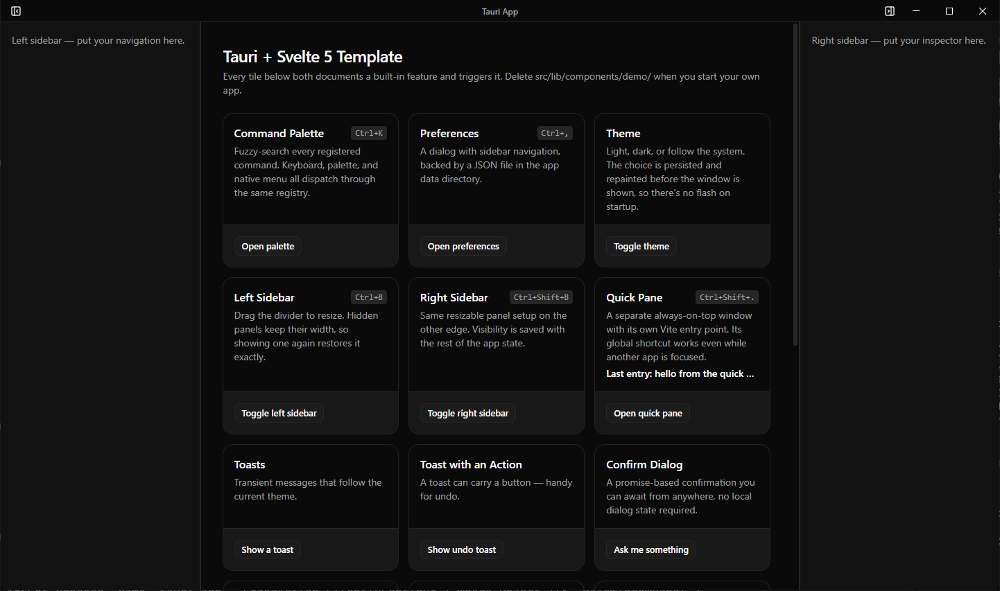

<h1 align="center">Tauri Svelte Template</h1>

<p align="center">
  <a href="https://github.com/frostybee/tauri-svelte-template/actions/workflows/ci.yml"></a>
  <a href="LICENSE"></a>
  
  
  
</p>

<p align="center">
  <a href="USING_THIS_TEMPLATE.md"><strong>Using this template</strong></a> ·
  <a href="docs/developer/README.md">Developer docs</a> ·
  <a href="#quick-start">Quick start</a> ·
  <a href="#whats-included">Features</a> ·
  <a href="https://github.com/frostybee/tauri-svelte-template/releases">Releases</a>
</p>

A starter template for desktop apps built with Tauri v2, Svelte 5, and TypeScript. Clone it, rename a few strings, and start building on a foundation that already handles the parts every desktop app needs.

<p align="center">
  
  <br>
  <em>Every tile documents a built-in feature and triggers it — command palette, sidebars, Quick Pane, toasts, native dialogs, and the typed Rust bridge.</em>
</p>


## What's included

### UI

- Custom titlebar with platform-native controls (macOS traffic lights, Windows buttons, Linux native)
- Dual resizable sidebars with persistent width and visibility
- Command palette with fuzzy search (Ctrl+K)
- Preferences dialog with sidebar navigation (General, Appearance, Advanced)
- Quick Pane: a floating always-on-top window triggered by a global shortcut, even while another app has focus
- Toast notifications and a promise-based confirm dialog
- Error boundary with crash recovery (saves diagnostics to disk, shows a reload fallback)

### Infrastructure

- Theme system: light, dark, and system modes with flash-free startup (no white flicker in dark mode)
- Typed IPC via tauri-specta: every Rust command has generated TypeScript bindings
- JSON persistence with atomic writes, corrupt-file recovery, and debounced saves
- Internationalisation via i18next with reactive `t()`, RTL support, and menus that rebuild on language change
- Native menu bar and right-click context menus, all dispatching through a single command registry
- Platform-aware shortcut formatting ("⌘K" on macOS, "Ctrl+K" on Windows)
- Global shortcuts with register/persist/rollback and a ShortcutPicker component
- Frontend logger that forwards warnings and errors to the Tauri backend in production

### Developer experience

- `check:all` pipeline: 10 gates from formatting to Rust tests, cheapest first
- ast-grep rules catching Svelte 5 IPC footguns and missing store flushes
- knip (unused code detection) and jscpd (copy-paste detection)
- CodeRabbit config for AI-powered PR reviews
- CI workflow (frontend + Rust on Ubuntu and Windows) and multi-platform release workflow
- `prepare-release.js`: version sync, quality gate, commit, tag
- Auto-updater pre-wired with signed artifacts
- Claude Code skills (`/setup`, `/check`, `/cleanup`, `/change-package-manager`) and subagents

## Quick start

```bash
pnpm install
pnpm tauri dev
```

See [USING_THIS_TEMPLATE.md](USING_THIS_TEMPLATE.md) for the full onboarding guide: renaming placeholders, removing demo content, adding your own commands and preferences.

## Stack

Tauri v2 · Svelte 5 · TypeScript · Tailwind v4 · shadcn-svelte · tauri-specta · i18next · paneforge · Vitest

## Scripts

| Script | What it does |
| --- | --- |
| `pnpm tauri dev` | Run the app with hot reload |
| `pnpm check:all` | Run every quality gate (formatting, lint, types, tests, Rust checks) |
| `pnpm test` | Vitest in watch mode |
| `pnpm rust:bindings` | Regenerate TypeScript bindings after changing a Rust command |
| `pnpm release v1.0.0` | Bump versions, run checks, commit, and tag |

## Project structure

```
src/
  main.ts                    Entry point (flash-free theme paint, then mount)
  App.svelte                 Root component: boot sequence, close handshake, layout
  lib/
    commands/                Command registry, palette state, command modules
    components/              Layout, preferences, demo, shadcn ui primitives
    stores/                  Preferences, app state, theme, UI convenience
    i18n/                    i18next config, language init, reactive t()
    quick-pane/              Cross-window event bridge
    shortcuts.ts             Shortcut parsing, normalisation, keydown dispatch
    menu.ts                  Native menu bar (rebuilt on language change)
    context-menu.ts          Native right-click menus
    tauri-bindings.ts        Typed IPC re-export with unwrapResult()
    logger.ts                Frontend logging (console in dev, backend in prod)

src-tauri/
  src/
    lib.rs                   Plugin chain, setup, close handshake
    commands/                json_store, preferences, app_state, global_shortcut,
                             quick_pane, recovery, lifecycle
    types.rs                 AppPreferences, PersistedAppState, ShortcutPurpose
  capabilities/              Per-window permission grants
  tauri.conf.json            App config (with platform overrides)
```

## Documentation

- [Using This Template](USING_THIS_TEMPLATE.md): how to clone, rename, customise, and ship
- [Developer Docs](docs/developer/README.md): reference docs for every subsystem (architecture, state, commands, theme, i18n, cross-platform, and more)

## License

Copyright (c) 2026 FrostyBee.

Tauri Svelte Template is licensed under the [MIT License](LICENSE). The UI primitives in `src/lib/components/ui/` are vendored from [shadcn-svelte](https://shadcn-svelte.com/) (MIT). See [THIRD-PARTY-NOTICE](THIRD-PARTY-NOTICE) for full attribution, and for what you need to generate before distributing your own build.

---

Getting started: [USING_THIS_TEMPLATE.md](USING_THIS_TEMPLATE.md) · Subsystem reference: [docs/developer](docs/developer/README.md)
